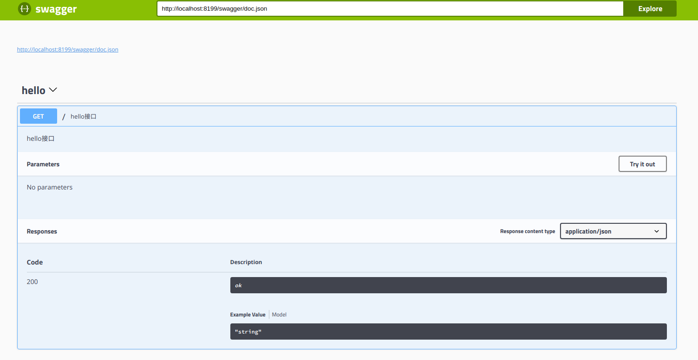

# gogf-swagger

gogf utility to automatically generate RESTful API documentation with Swagger 2.0.

## Port from https://github.com/swaggo/gin-swagger

## Usage

### Start using it
1. Add comments to your API source code, [See Declarative Comments Format](https://swaggo.github.io/swaggo.io/declarative_comments_format/).
2. Download [Swag](https://github.com/swaggo/swag) for Go by using:
```sh
$ go get -u github.com/swaggo/swag/cmd/swag
```

3. Run the [Swag](https://github.com/swaggo/swag) in your Go project root folder which contains `main.go` file, [Swag](https://github.com/swaggo/swag) will parse comments and generate required files(`docs` folder and `docs/doc.go`).
```sh
$ swag init
```
4.Download [gogf-swagger]() by using:
```sh
$ git clone https://github.com/zhwei820/gogf-swagger.git
```
And import following in your code:

```go
import "github.com/zhwei820/gogf-swagger" // gogf-swagger middleware
import "github.com/zhwei820/gogf-swagger/swaggerFiles" // swagger embed files

```

### Canonical example:

```go
package main

import (
	"github.com/gogf/gf/g"
	"github.com/gogf/gf/g/net/ghttp"
	"github.com/zhwei820/gogf-swagger"
	"github.com/zhwei820/gogf-swagger/swaggerFiles"

    _ "github.com/zhwei820/gogf-swagger/example/docs"

)

//
// @Summary hello接口
// @Description hello接口
// @Tags hello
// @Success 200 {string} string	"ok"
// @router / [get]
func hello(r *ghttp.Request) {
	r.Response.Writeln("哈喽世界！")
}


// @title Swagger Example API
// @version 1.0
// @description This is a hello server .
// @termsOfService http://hello.io/terms/

// @contact.name hello
// @contact.url http://www.hello.io
// @contact.email hello@hello.io

// @license.name Apache 2.0
// @license.url http://www.apache.org/licenses/LICENSE-2.0.html

// @host
// @BasePath /
func main() {
	s := g.Server()
	s.BindHandler("/", hello)

	url := gogfSwagger.URL("http://localhost:8199/swagger/doc.json") //The url pointing to API definition
	s.BindHandler("/swagger/*any", gogfSwagger.WrapHandler(swaggerFiles.Handler, url))

	s.SetPort(8199)
	s.Run()
}
```

5. Run it, and browser to http://localhost:8199/swagger/index.html, you can see Swagger 2.0 Api documents.



